Status & Disclaimer

This is an alpha/non-production release. All core functions work without critical errors, but I'm still refining several areas before considering it production-ready.
Current Limitations:

    Installation is complex (working on simplification)
    README documentation is ~80% complete (a few sections remain)
    Some sections need refinement (see Known Issues below)
    Open to modifications and improvements that enhance usability or installation

Known Issues

    Inpaint and Restore Image sections — Need refinement for better reliability
    Step 2 modules — Some still in development (Skin Fix module particularly)
    Model focus — Primarily designed for SDXL-type models, with a small Flux section included

Requirements

    ComfyUI
    19 custom nodes (see list at bottom of README)
    Tested on AMD 16GB VRAM; should work on any card capable of generating SDXL 1.0 images

     
   I have created a very large and, I think, very unique workflow that is very advanced, but I am afraid it is advanced in some areas and missing some of the more basic parts. I have been making it by trial and error as I go along, and have made it really flexible. Most of the options have been designed with SDXL models in mind, but there are a few exceptions with FLUX, Inpaint, and Kandinsky5. 
  
To give an example, I generally use:
<ul>
   <li>The SDXL based 'cyberrealisticPony_v141.safetensors' 
      <ul>
      <li>A larger, but also faster and less Vram consuming model. While it is not strictly known for being 'photorealistic', it is generally 'good enough'. 
         <li>Used best with Danbooru tags (1girl, solo, etc.).</li></ul>
   <li>The SDXL based  'juggernautXL_ragnarokBy.safetensors'
      <ul>
   <li>Known for being more 'photorealistic', this is a slightly slower and more Vram hungry model. It is also harder to control and might give better results than my favored pony model sometimes,  and terrible results most other times.
      <li>Used best with Natural Language prompts (A woman standing...)</li>
      </ul>
</li>
</ul> 

   There are two main sections or Steps. First is the input step. A long side of the workflow with dynamic choices for text-to-image, image-based + text-to-image, inpainting, photo restoration, flux-only, and a few more. The second step is the fine-tuning part. Again, fully dynamic, where you can pick and/or all of the "modules" like skin fix, face fix, K-Sampler Cycle fix, face swap, upscale, and more.

   Some parts have been added and adapted from other sources on the internet. An example is the flux image generation part. I did not make that one, but I did use other nodes to incorporate it into the workflow as another generation option within the list of "step 1" generation choices.

   There are options within options here that are constantly being rewritten, streamlined, and even a few unfinished (but hopefully working) parts. I'll try to keep this as short as possible while hopefully explaining a good amount.

   I have created this using a Windows box with an AMD 16GB VRAM card. It has taken me months to find the perfect balance of torch/Rocm/nodes/onnx/drivers and more. It might be a great idea to update in most cases, but this has taken me months, and I have no wish to update all and risk having to delete everything and re-install (I’m especially looking at you, ReActor. A great little node, but picky as hell)… Due to possible health and family concerns, I am trying to add this to a public repo asap and have not written everything down yet. This will take a number of custom nodes that I think some people will have problems with, and it might not be the most efficient, but it is working for me, and I have only been using ComfyUI image generation for about 10 months now, and I have never really gone over the basic steps. I just learned today that the ComfyUI Manager has a snapshot manager…damn. That could have saved me about a month of work alone.

> [!IMPORTANT]
> Each section in steps 1 and 2 will have a ‘Preview Image’ box. The workflow does not use any auto-save method. Please only right-click and choose Save As in the ‘Preview Image’ box (this is fine with batch images as well). Saving from the ‘Image Comparer’ or anything else might not work or give unexpected results. The only exception is the video module at the very end, which does save a file after each run. 

Example 1:

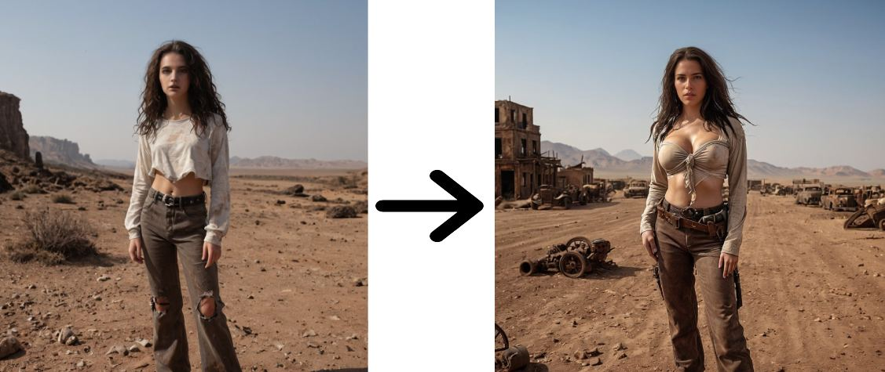

<ul>
    <li>Started with Generate Image from Text in step 1. The photo generated is not quite what I had in mind; the face is bad, the hands are weird, and the photo is generally bad. This is a great photo to use as a demonstration, and it gives a better example of the next step. </li>

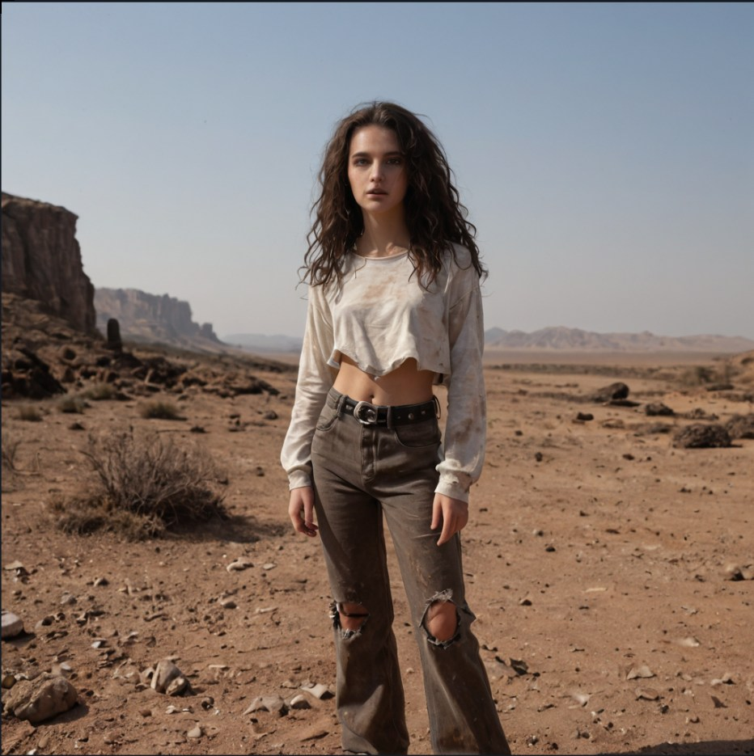

<li>Lets take this bad image to step 2. The first module to try is '01) Fine Tune Image'. Creating the prompt for a different checkpoint while using the old image as a base, we have a new image that is closer to what I was thinking. The face and hands are still bad, but there is more.</li>

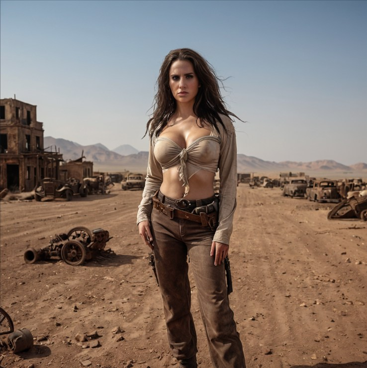

<li>Now, move back to the choose menu for step 2 and select faceswap and hand fix</li>

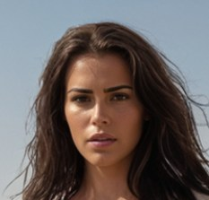

<li> Leaving us at the '07) Ksampler Cycle Fix' module where it will help blend any of these changes and upscale the image.</li>

Finished png with workflow:

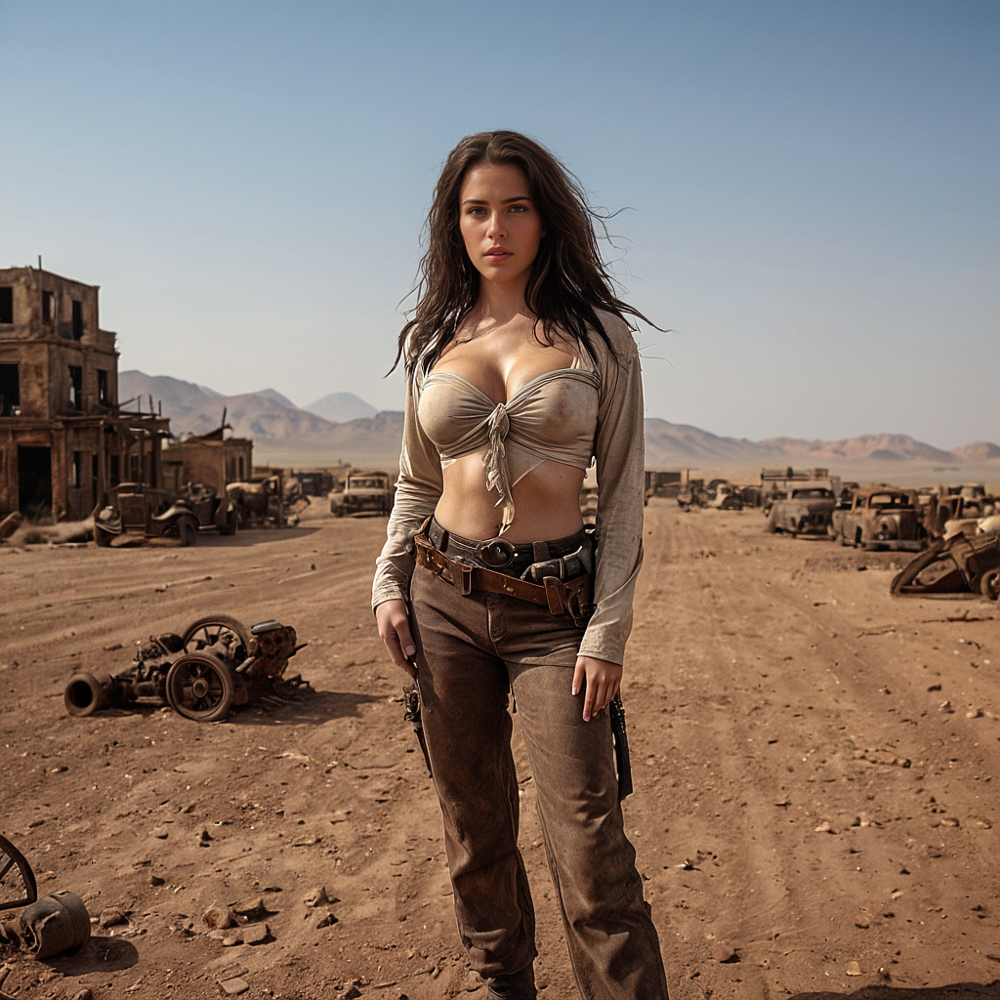

</ul>

Example 2:

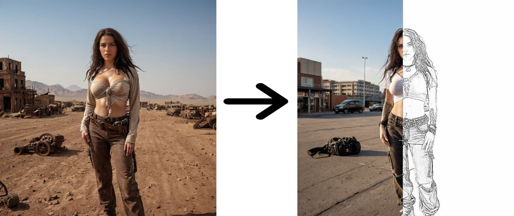

<ul>
    <li>Started with Generate Image from Image and Text in step 1.  I am using the output frrom the above example as an the base photo.</li>

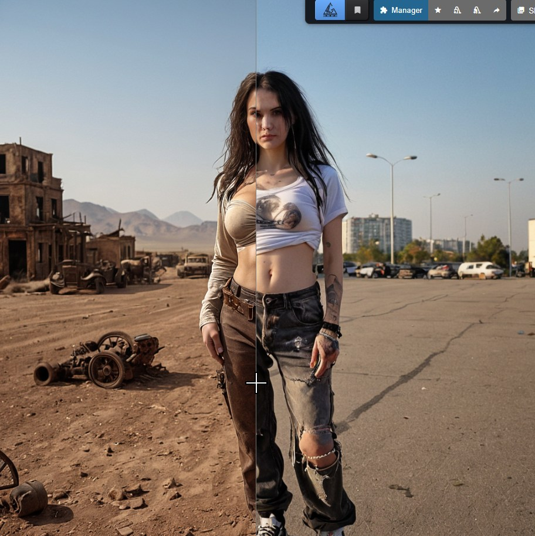

<li>The first module to try is '01) Fine Tune Image'. Creating the prompt for a different checkpoint while using the old image as a base, we have a new image that is closer to what I was thinking. The face and hands are still bad, but there is more.</li>

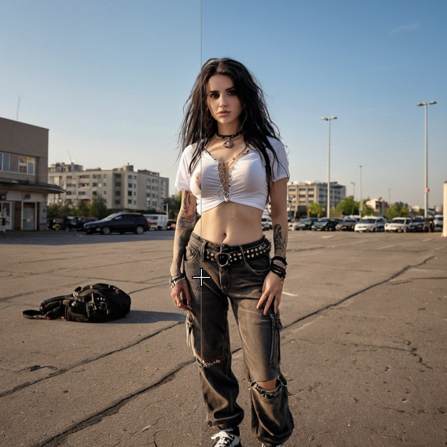

<li>Now, move back to the choose menu for step 2 and select faceswap and hand fix</li>

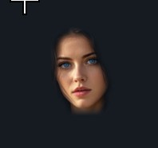

<li>Press '2' to go back to the choose menu again and select 'Blend and Adjust Face Expression' with the options for 'Remove Background' and 'PencilSketch' enabled.

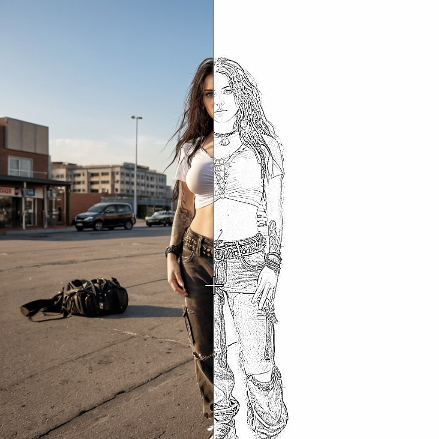

Finished png with workflow:

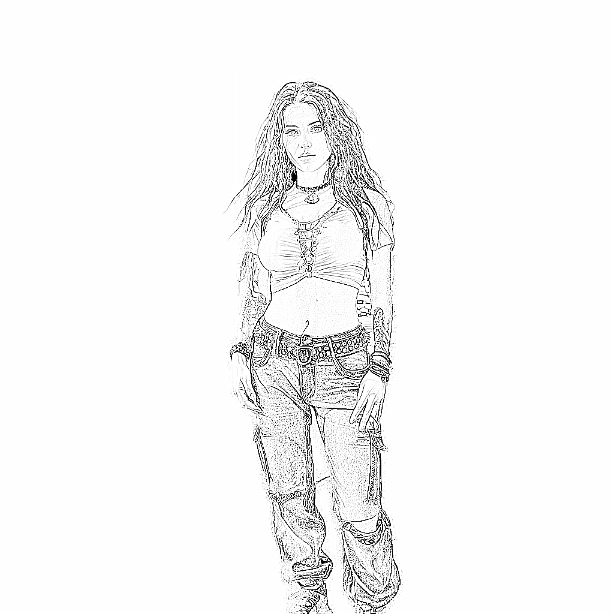

</ul>

<h1>&nbsp;&nbsp;&nbsp;&nbsp;&nbsp;&nbsp;&nbsp;&nbsp;&nbsp;&nbsp;&nbsp;&nbsp;&nbsp;&nbsp;&nbsp;&nbsp;<ins>Step 1:</ins></h1> 
Step one is known as the "input" step where you can create an image or bring in any image to work on, inpaint is an example. First, start by selecting one of several different ways to start within the "Step 1" section 'Choose' box.

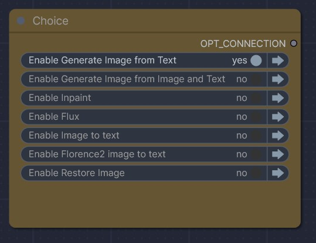

 
&nbsp;&nbsp;&nbsp;&nbsp;➡️ Generate Image from Text.  This is the most used and robust option. Just type what you want to see in the positive prompt and type what you don't want to see in the negative. Sound easy? Ha! By default, it will create a batch of 4 images.

    

    <ul>
        I am trying to go in some top-down, left-to-right logical order.
        <li>First is a notes box.</li>
        <li>The "Set" box where you can choose several options</li>

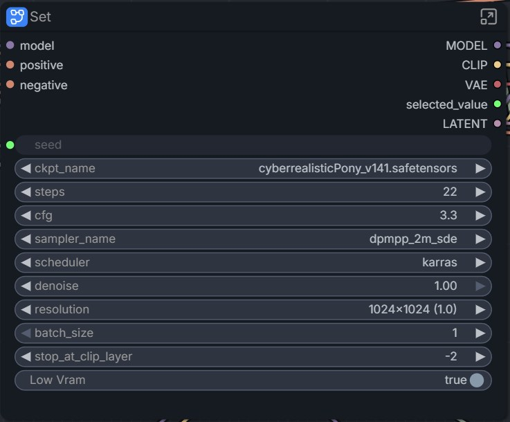

<ul>
            <li>ckpt_name - The model name you are using. This is normally a checkpoint file, like cyberrealisticPony_v141.safetensors or sd-v1-5.safetensors</li>
            <li>steps</li> 
            <li>cfg</li>
            <li>sampler_name</li>
            <li>scheduler</li>
            <li>resolution - SXDL-sized options enabling easy selection between formats.</li>
            <li>batch_size - Best settings are with in 1 to 4 images.</li>
            <li>stop_at_clip_layer -  option to control clip encoding for lesser or greater detail/control.</li>
            <li>Low Vram - A toggleable setting enabling titled VAE for easier Vram use, as well as Vram debugging and clearing to increase speed and efficiency. Enabling the Low Vram option will use tiled output and use the Vram debug to clear cache, collect garbage, and unload any model data. Disabling this option will use full VAE decode and will only use the Vram debug node to clear cache and collect garbage, but will not unload any model data.</li>
        </ul>
         <li>The rgthree seed selector node makes seed control much easier and faster.</li>
        <li>The power lora loader by rgthree to load any lora's you wish.</li>
        <li>Prompt Library - This will enable you to choose a prompt by building it with a set of pre-made cards, allowing you a starting pad to try new combinations.</li>
        
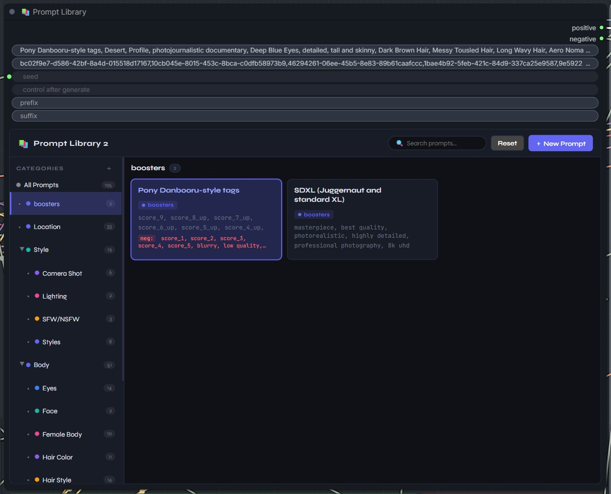

<li>The 'Prompt Library 2 Auto Positive Prompt' and 'Prompt Library 2 Auto Negative Prompt' are where the selected prompt is displayed.</li>

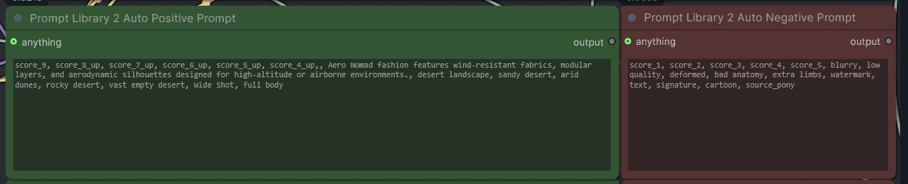

<li>The two boxes under that are the 'Additional Positive Prompt' positive prompt (Green as well) and 'Additional Negative Prompt' in red color, to enable a quick addition of any extra or typed prompts. This can be used in addition to the first positive prompt, the only positive prompt, or just left blank. It's all dynamic.</li>

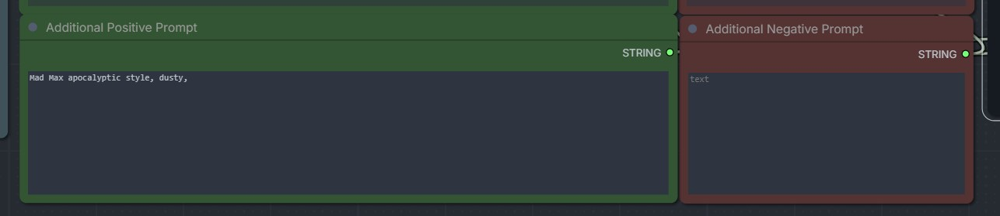

<li>The preview image box should show each image generated in the batch, and is always the best way to save any image you choose.</li>

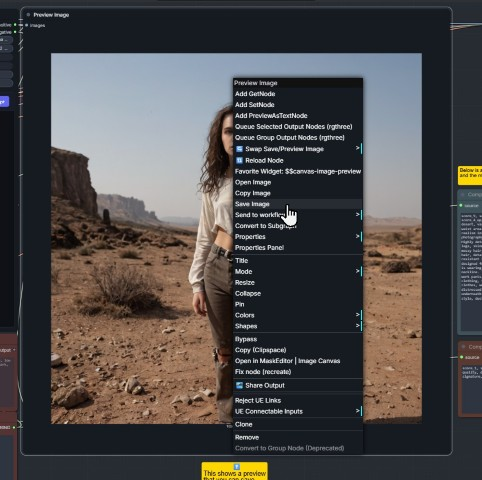

<li>The ‘Batch Image’ box, where you can select the image you want to use in Step 2. This is an updated number scheme where the first image is 1, then 2, and so on. This will send *only* the image from the batch that you like to send to "step 2"-image adjustment. 
            
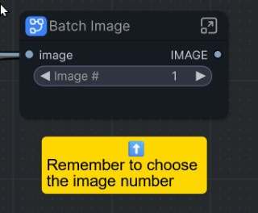

 <li>The last two boxes represent the combined output of the auto prompt and the manual prompt, placed into the combined positive (pale blue) and negative (brown) prompts for added convenience.</li>

            
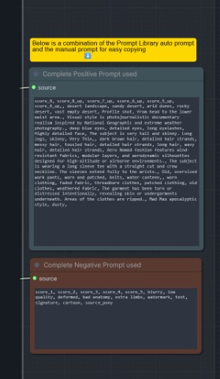

</ul>
</ul>

 
  
&nbsp;&nbsp;&nbsp;&nbsp;➡️ Generate Image from Image and Text.  

    <ul>
    <li>First you have a load image box.</li>
    <li>You have the "set" box where you can choose many options.</li>

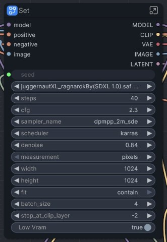

<ul>
            <li>ckpt_name - The model name you are using. This is normally a checkpoint file, like cyberrealisticPony_v141.safetensors or sd-v1-5.safetensors</li>
            <li>steps</li> 
            <li>cfg</li>
            <li>sampler_name</li>
            <li>scheduler</li>
            <li>denoise - </li>
    <li>measurement</li>
    <li>width</li>
    <li>height</li>
    <li>fit</li>
    <li>batch_size - Number of images to create at once in a batch. It is not recommended to go above 4.</li>
            <li>stop_at_clip_layer -  option to control clip encoding for lesser or greater detail/control.</li>
            <li>Low Vram - A toggleable setting enabling titled VAE for easier Vram use, as well as Vram debugging and clearing to increase speed and efficiency. Enabling the Low Vram option will use tiled output and use the Vram debug to clear cache, collect garbage, and unload any model data. Disabling this option will use full VAE decode and will only use the Vram debug node to clear cache and collect garbage, but will not unload any model data.</li>
        </ul>
   <li>The rgthree seed selector node makes seed control much easier and faster.
   <li>The power lora loader by rgthree to load any lora's you wish.
   <li>Main positive prompt (Green) and Negative prompt (Red).

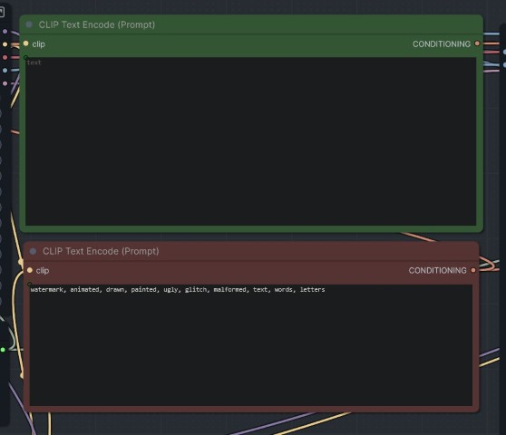

   <li>Image Comparer (rgthree) allows you to compare each image in the batch to the original image.
<li>The preview image box should show each image generated in the batch, and is always the best way to save any image you choose.</li>

 <li>The ‘Batch Image’ box, where you can select the image you want to use in Step 2. This is an updated number scheme where the first image is 1, then 2, and so on. This will send *only* the image from the batch that you like to send to "step 2"-image adjustment. 
            

</ul>

 

&nbsp;&nbsp;&nbsp;&nbsp;👉 Inpaint.  Can be tricky. The end of the section has a second model selected to go off a non-Inpaint model. 
❗️This input step is currently not working well. I am leaving it in hopes that it can be fixed at a later date.

<ul>
  <li>There are two ‘Load Image’ boxes. Load the same image into both of these, then right-click the lower one and select ‘Open in Maskeditor’ to highlight the section of the image that you want to change.
  <li>The Set box will have many options you can change, like the model, vae_name, clip layer, and so on.
    <ul>
      <li>Vram usage is selectable from 1 (full VAE decode) and 2 (tiled decode, using less Vram.)
      <li>stop_at_clip_layer option to control clip encoding for less or greater detail/control.
      <li>✏️Vram debugging and clearing to increase speed and efficiency.</li>
    </ul>
  <li>The rgthree seed selector node makes seed control much easier and faster.
  <li>The power lora loader by rgthree to load any lora's you wish.
  <li>Main positive prompt (Green) and Negative prompt (Red).
  <li>A ‘Mask Preview’ box that just shows what it is working with for clarity.
  <li>Image Comparer (rgthree) allows you to compare the generated image to the original image.
  <li>Another load checkpoint box so you can continue to step 2 with a full (not inpaint only) model. 
    <ul>
       <li>Note: Most modules in Step 2 have been updated to where you must select a safe tensors file when needed, so this might not be used in most cases. This is a great way of mixing the different model parts together, like the face fix. I normally use Pony and Juggernaut, and now have the option to generate an image with Pony, but I experiment with some fixes with other models to only fix the Fine tune Image, skin, face, or hands. </li></ul>
  <li>The preview image box should show the image generated, and is always the best way to save any image you choose.
  </li>
</ul>

 

&nbsp;&nbsp;&nbsp;&nbsp;👉 Flux.  Use text-to-image generation with Fulx.

<ul>
    <li>General note file that the original author included.</li>
<li>The Set box will have many options you can change, like the model (unet), clip names, and so on.
    <ul>
      <li>unet_name - Flux checkpoint name.</li>
<li>weight_dtype</li>
<li>clip_name1</li>
<li>clip_name2</li>
<li>type</li>
<li>device</li>
<li>vae_name</li>
<li>seed</li>
<li>steps</li>
<li>cfg</li>
<li>sampler_name</li>
<li>scheduler</li>
<li>denoise</li>
<li>width</li>
<li>height</li>
<li>batch_size - Number of images to create at once in a batch. It is not recommended to go above 4.</li>
<li>Low Vram - A toggleable setting enabling titled VAE for easier Vram use, as well as Vram debugging and clearing to increase speed and efficiency. Enabling the Low Vram option will use tiled output and use the Vram debug to clear cache, collect garbage, and unload any model data. Disabling this option will use full VAE decode and will only use the Vram debug node to clear cache and collect garbage, but will not unload any model data.</li>
    </ul>
<li>Main positive prompt (Green only, flux doesn't use a negative prompt).
<li>The preview image box should show the image generated, and is always the best way to save any image you choose.
<li>The ‘Batch Image’ box, where you can select the image you want to use in Step 2. This is an updated number scheme where the first image is 1, then 2, and so on. This will send *only* the image from the batch that you like to send to "step 2"-image adjustment. 
            

</ul>

 

&nbsp;&nbsp;&nbsp;&nbsp;👉 Image to text  Uses 'comfyui-easy-use/easy imageInterrogator' node to read images into text descriptions. See how an AI describes images. You can also take the description and copy it to the 'Generate Image from Text' to change it anyway you want.

<ul>
   <li>Load Image box for any image you want the AI to 'see'.</li>
  <li>The Set box will have many options you can change, like the model, steps, cfg, and so on.
    <ul>
      <li>seed</li>
      <li>ckpt_name</li>
      <li>steps</li>
      <li>cfg</li>
      <li>sampler_name</li>
      <li>scheduler</li>
      <li>denoise</li>
      <li>resolution</li>
      <li>mode</li>
      <li>batch_size - Number of images to create at once in a batch. It is not recommended to go above 4.</li>
      <li>Generate Image? - A toggleable option to generate an image from the generated text.</li>
      <li>Low Vram - A toggleable setting enabling titled VAE for easier Vram use, as well as Vram debugging and clearing to increase speed and efficiency. Enabling the Low Vram option will use tiled output and use the Vram debug to clear cache, collect garbage, and unload any model data. Disabling this option will use full VAE decode and will only use the Vram debug node to clear cache and collect garbage, but will not unload any model data.</li>
    </ul>
   <li>The Positive and negative prompts are actually just text as output from the imageInterrogator node and can't be directly edited.
   <li>The preview image box should show the image generated, and is always the best way to save any image you choose.
   <li>The ‘Batch Image’ box, where you can select the image you want to use in Step 2. This is an updated number scheme where the first image is 1, then 2, and so on. This will send *only* the image from the batch that you like to send to "step 2"-image adjustment. 
            

</ul>

 

&nbsp;&nbsp;&nbsp;&nbsp;👉 Florence2 image to text  Another type of image-to-text node that usually gives better or more detailed results.  
❗️Due to it needing a different model in order to first read the image, there are two sections in the 'Florence2 image to text' box.

<ul>
   <li>Load Image box for any image you want the AI to 'see'. 
  <li>The Set box will have many options you can change, like the model, steps, cfg, and so on. Any options above the 'Generate Image?' option in the box are for the Florence2 model. Any option under 'Generate Image?' is for generating a new image using the output.
    <ul>
      <li>Generate Image? - A toggleable option to generate an image from the generated text.</li>
      <li>Low Vram - A toggleable setting enabling titled VAE for easier Vram use, as well as Vram debugging and clearing to increase speed and efficiency. Enabling the Low Vram option will use tiled output and use the Vram debug to clear cache, collect garbage, and unload any model data. Disabling this option will use full VAE decode and will only use the Vram debug node to clear cache and collect garbage, but will not unload any model data.</li>
    </ul>
   <li>The rgthree seed selector node makes seed control much easier and faster.
   <li>The Positive and negative prompts are actually just text output from the imageInterrogator node and can't be directly edited.
   <li>The preview image box should show the image generated, and is always the best way to save any image you choose.
   <li>The ‘Batch Image’ box, where you can select the image you want to use in Step 2. This is an updated number scheme where the first image is 1, then 2, and so on. This will send *only* the image from the batch that you like to send to "step 2"-image adjustment. 
            

</ul>

 

&nbsp;&nbsp;&nbsp;&nbsp;👉 Restore Image 
Simple image restoration. The checkpoint selection for a model does nothing to the 'Restore Image' section and is only used in some areas of Step 2.

<ul>
   <li>Load Image box for any image you want to restore. 
   <li>The Set box will have many options you can change for image restoration.
   <li>The Positive and negative prompts are actually just text as output from the imageInterrogator node, and can't be directly edited.
   <li>Image Comparer (rgthree) allows you to compare the generated image to the original image.
   <li>The preview image box should show the image generated, and it is always the best way to save any image you choose.
   </li>
</ul>

 

> [!NOTE]
> ✏️ Press the number 1 to jump back to the 'Step 1 Choice box' area.

   

<h1>&nbsp;&nbsp;&nbsp;&nbsp;&nbsp;&nbsp;&nbsp;&nbsp;&nbsp;&nbsp;&nbsp;&nbsp;&nbsp;&nbsp;&nbsp;&nbsp;<ins>Step 2:</ins></h1> 
This is the edit section, where you can edit or refine the image created in step one. You can choose to enable any option or options to continue. Just click any yes or no button(s) in the ‘Choose’ menu at step 2. All modules are fully modular and made to work in any combination or number, but they can not change the direction (i.e., no Upscale before Face Swap. Only Face Swap and then Upscale.) So you can use the Face Fix and the Upscale while leaving Fine Tune, Face Swap, and Blend and Adjust Face Expression disabled, and it should just skip them. But I suggest only activating extra groups one at a time (You don't have to process more until you are ready; otherwise, it will be a lot of wasted generations and slow things down. A good example is if I wanted to do Face Fix and Upscale, I would first do Face Fix, then come back to this menu (press '2' to jump here) and then enable Upscale, leaving Face Fix still on.)

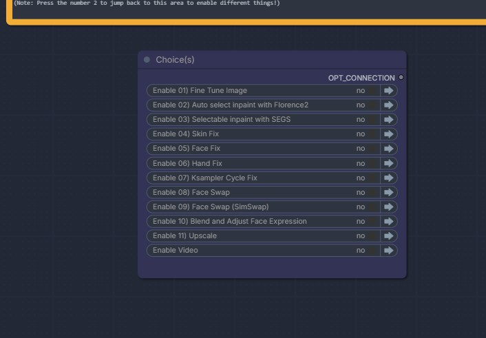

  

&nbsp;&nbsp;&nbsp;&nbsp;➡️ Fine Tune Image 
Will take the one image you selected from the previous batch of pictures and give it a retouch. A light re-draw to the full image to help with artifacts or changes.

<ul>
   <li>Main positive prompt (Green) and Negative prompt (Red).</li>
   <li>You have the "set" box where you can choose...</li>
    <ul>
      <li>ckpt_name - The model name you are using. This is normally a checkpoint file, like cyberrealisticPony_v141.safetensors or sd-v1-5.safetensors</li>
<li>seed - this is handled by the rgthree seed selector node below the set box.</li>
<li>steps</li>
<li>cfg</li>
<li>sampler_name</li>
<li>scheduler</li>
<li>denoise</li>
<li>batch_size - Number of images to create at once in a batch. It is not recommended to go above 4.</li>
<li>stop_at_clip_layer -  option to control clip encoding for lesser or greater detail/control.</li>
<li>Low Vram - A toggleable setting enabling titled VAE for easier Vram use, as well as Vram debugging and clearing to increase speed and efficiency. Enabling the Low Vram option will use tiled output and use the Vram debug to clear cache, collect garbage, and unload any model data. Disabling this option will use full VAE decode and will only use the Vram debug node to clear cache and collect garbage, but will not unload any model data.</li>
    </ul>
   <li>The rgthree seed selector node makes seed control much easier and faster.
   <li>The power lora loader by rgthree to load any lora's you wish.
   <li>The preview image box should show each image generated in the batch, and is always the best way to save any image you choose.
   <li>The ‘Batch Image’ box, where you can select the image you want to use in Step 2. This is an updated number scheme where the first image is 1, then 2, and so on. This will send *only* the image from the batch that you like to send to "step 2"-image adjustment. 
            
(Remember to mess with denoise to give the  generating model more or less freedom in the new image!)
</ul>

 

&nbsp;&nbsp;&nbsp;&nbsp;👉 02) Auto select Inpaint with Florence2 
A different version of Face Swap is used. SimSwap is a higher-quality and more adjustable tool, but it is also very hard to get right.

<ul>
   <li> test </li>
</ul>

 

&nbsp;&nbsp;&nbsp;&nbsp;👉 03) Selectable Inpaint with SEGS 
A different version of Face Swap is used. SimSwap is a higher-quality and more adjustable tool, but it is also very hard to get right.

<ul>
   <li> test </li>
</ul>

 

&nbsp;&nbsp;&nbsp;&nbsp;👉 Skin Fix 
It is usually best to do this step before a Face or Hand Fix; however, I normally do not use this very often, as the results are usually bad, and you might spend a long time messing with the settings.

<ul>
   <li>Main positive prompt (Green) and Negative prompt (Red).
   <li>You have the "set" box where you can choose several options.
<ul>
<li>ckpt_name - The model that will be used. There is currently no option to use the old model and prompt, and one must state new ones.</li>
<li>SEGM</li>
<li>BBOX</li>
<li>SAM</li>
<li>Detailer Hook</li>
</ul>
   <li>The power lora loader by rgthree to load any lora's you wish.
   <li>The SkinDetailer box.
   <li>The pink masking box with three different windows that show which mask in chosen and how it is selected.
   <li>Image Comparer (rgthree) allows you to compare the generated image to the original image.
   <li>The preview image box should show each image generated in the batch, and is always the best way to save any image you choose.
   </li>
</ul>

 

&nbsp;&nbsp;&nbsp;&nbsp;👉 Face Fix 
Regenerate a new face. Many faces you generate will have bad faces, like crooked eyes, or something wrong, but the body is perfect. This will help if you used too many loras and messed up the face.

<ul>
   <li>Main positive prompt (Green) and Negative prompt (Red).</li>
   <li>You have the "set" box where you can choose several options.</li>
<ul>
<li>ckpt_name - The model that will be used. There is currently no option to use the old model and prompt, and one must state new ones.</li>
<li>SEGM</li>
<li>BBOX</li>
<li>SAM</li>
<li>Detailer Hook</li>
</ul>
   <li>The power lora loader by rgthree to load any lora's you wish.</li>
   <li>The FaceDetailer box.</li>
   <li>The pink masking box with three different windows that show which mask in chosen and how it is selected.</li>
   <li>Image Comparer (rgthree) allows you to compare the generated image to the original image.</li>
   <li>The preview image box should show each image generated in the batch, and is always the best way to save any image you choose.</li>
</ul>

 

&nbsp;&nbsp;&nbsp;&nbsp;👉 Hand Fix 
This will try to find and fix broken or messed-up fingers and hands.

<ul>
   <li>Main positive prompt (Green) and Negative prompt (Red).
   <li>Three small boxes under the prompt windows with detailer options.
   <li>The FaceDetailer box (with hand_* in UltralyticsDetectorProvider).
   <li>The pink masking box with three different windows that show which mask is chosen and how it is selected.
   <li>Image Comparer (rgthree) allows you to compare the generated image to the original image.
   <li>The preview image box should show each image generated in the batch, and is always the best way to save any image you choose.
   </li>
</ul>

 

&nbsp;&nbsp;&nbsp;&nbsp;👉 Ksampler Cycle Fix 
Much like 'Fine Tune Image', this will redraw the image using cycles of the sampler and combine them. This is more focused on blending and refining any 'Fix', but can be used alone, without any other 'Fix' enabled, but it might not do very much.

<ul>
   <li>Main positive prompt (Green) and Negative prompt (Red).
   <li>You have the "set" box where you can choose several options.
<ul>
<li>Custom? -  A toggleable option to use the older model and prompt data(disabled), or use the prompt and model name chosen below instead for more custom Ksampler work(enabled).</li>

> ⚠️[NOTE]
> A custom load must be used, or anything added to the prompt windows above is ignored, and only the original generation prompts are used.

<li>ckpt_name - The model that will be used. There is currently no option to use the old model and prompt, and one must state new ones.</li>
</ul>
<li>The power lora loader by rgthree to load any lora's you wish.</li>
</ul>

 

&nbsp;&nbsp;&nbsp;&nbsp;👉 Face Swap 
Use face swap to change the face on the image to another face. ReActor is a fast and good faceswap, just very hard to install, at least it was very difficult for me!

<ul>
   <li>First is the ReActor Fast Face Swap box. 
    <ul>
      <li>✏️The only real setting you will want to change is the 'input_faces_index' to search for faces (starting from left to right, 0,1, etc.) So if you only want to change the second person's face in a photo, you would just put 1. It can take some playing with before it finds the right thing. Remember that anything that is close to a face counts! Posters, people way in the background, the Monalisa, a pile of garbage that kind of looks like a face if you squint really hard.</li>
    </ul>
   <li>Swap Choice box. A choice of auto-selecting up to 3 extra faces. This was put in to make it easier if you don't want to mess with the index count.
   <li>ReActor Face Booster. You can try using this or disable it. The booster is usually a little too much and can make things look odd.
   <li>Load Image box for any image you want to work on. 
   <li>Image Comparer (rgthree) allows you to compare the generated image to the original image.
   <li>The preview image box should show each image generated in the batch, and is always the best way to save any image you choose.
   </li>
</ul>

 

&nbsp;&nbsp;&nbsp;&nbsp;👉 Face Swap (SimSwap) 
A different version of Face Swap is used. SimSwap is a higher-quality and more adjustable tool, but it is also very hard to get right.

<ul>
   <li> test </li>
</ul>

 

&nbsp;&nbsp;&nbsp;&nbsp;👉 Blend and Adjust Face Expression 
Change the lighting, contrast, and other image settings with the ability to change some facial parameters.

<ul>
   <li> test </li>
</ul>

 

&nbsp;&nbsp;&nbsp;&nbsp;👉 Upscale 
1x and 2x Upscale with a second preview window showing the 1x upscale version without the enlargement at full 1 to 1 quality. Upscales will have some light image enhancement and fine detail added(like hair, face, etc.).

<ul>
   <li> test </li>
</ul>

 

&nbsp;&nbsp;&nbsp;&nbsp;👉 Video 
A small workflow that I added and changed a few things to make it where I  could dynamically just add the image I made through the workflow (it just saves me the time of saving files and swapping workflows)

<ul>
   <li> test </li>
</ul>

 

Would I ever do Face Fix and Face Swap at once? Well, yes. I have had several face swaps that looked odd because the face finder didn't work well and gave her a crooked jaw or no real lower lip...so A fresh regen of the face might help. 
Remember: Face Fix (Or regen) will capture ANY face (Picture on a shirt, poster, background guy, anything. But the Face Swap only works on one face unless you mess with the input_faces_index, and there is no way to get the Expressions node to work with more than one face, so you might find it useful to do a face regen on a photo of two hikers when they find a bear. Use Face Fix to tweak the facial features just about right, then do a face swap, and the face swap should overlay the face on top, not overwrite it. But just in case...now you can. Yay! 
 

> [!NOTE]
> ✏️ Press the number 2 to jump back to the 'step 2 Choice(s) box' to enable different things!)

  
Change log

1.45a (6/12/26)
<ul>
<li>Removed the `Quick Image` section from Step 1 options.</li>
<li>Improved and deployed Vram subgraph to each section and module.</li>
<li>Added several new sections to the 'Generate Image from Text' box, including the custom Prompt Library node I found and edited. You can choose any prompt by clicking; this will affect both positive and negative prompting when changed. The new prompt will be automatically built into a text string that will be shown under the node window, in green (for positive prompts) and red (for negative prompts). Two boxes are provided below them, both colored green and red like the prompt boxes, allowing you to type anything to be added to the generator. </li>
<li>Added two windows at the end of the 'Generate Image from Text' box that give you a quick output of both the auto-prompt created by Prompt Library 2 and manual entry to easily copy and paste if needed.</li>
<li>Added two new modules to the Step 2 area. '02) Auto select Inpaint with Florence2' and '03) Selectable Inpaint with SEGS'.</li>
<li>Added five new options in '10) Blend and Adjust Face Expression'. <ul><li>Remove Background</li><li>Quantize</li><li>Solarize</li><li>PencilSketch</li><li>FilmGrain</li> can be used individually or combined for different effects.</ul>
<li>Rebuilt the set box in the Image to text section and added a 'Generate Image?' toggleable option to generate an image from the generated text.
<li>Skin Fix and Face Fix now have a dedicated checkpoint loader. Hand Fix still uses the original model.</li>
<li>Ksampler Cycle Fix now has a 'Custom' toggle button to use in place of the original model/clip/prompts</li>
    <li>Refined image swapping logic between steps and within modules.</li>
<li>Changed notification sound after image/video generation from the 'ComfyUI-Notifications' nodes to the 'comfyui-custom-scripts' node set. I really like the system notification node that I can use for the video generation module. Try to ignore the error about the path in the server console. The creator is aware of this, but assures it is working fine. I find it slightly annoying, but after fighting every step of the way with editing the prompt library node, I get it. It works, next subject.</li>

</ul> 
    
    
1.44.5-alpha-2 (5/1/26)
<ul>
<li>All Step 1 image generation options now use tiled VAE decode for efficient VRAM usage (with full VAE decode fallback available)</li>
<li>VRAM debugging via comfyui-kjnodes for better memory management</li>
<li>Batch Image selectors now use 1-based numbering (select image #1 for the first image, not #0)</li>
<li>New Step 1 section called 'Quick Image' with node from https://github.com/florestefano1975/ComfyUI-Prompt-Library. I am hoping to replace the Prompt database used in 'Generate Image from Text' with a more flexible one.</li>
<li>Added the Vram selector box to "5) Ksampler Cycle Fix" with both the option to use free VAE or tiled, and Vram Debug</li>
<li>Added 'PC: Schedule LoRAs' to Step 1 section called 'Quick Image' from https://github.com/asagi4/comfyui-prompt-control to enable LoRA adding within the prompt <lora:filename:1.0></li>
<li>Cleaned up some extra nodes (preview image nodes and one Context (rgthree)node)</li>
</ul> 
    
******************************************
<ul>
<li>Python version: 3.11.9</li>
<li>AMD arch: gfx1201</li>
<li>ROCm version: (7, 2)</li>
<li>ComfyUI version: 0.20.1</li>
<li>ComfyUI frontend version: 1.42.15</li>
<li>Torch version: 2.10.0+rocm7.12.0a20260201</li>
</ul> 
19 custom nodes:

   <ul>
   <li>ComfyUI-Prompt-Library from https://github.com/NoudH/ComfyUI-Prompt-Library (Please use the custom copy in the files section above)</li>
<li>ComfyUI Impact Pack 8.28.2</li>
<li>ComfyUI-Custom-Scripts 1.2.5</li>
<li>rgthree-comfy 1.0.251211205</li>
<li>ComfyUI-AdvancedLivePortrait 1.0.0</li>
<li>ComfyUI-KJNodes 1.2.9</li>
<li>ComfyUI-Easy-Use 1.3.4</li>
<li>ComfyUI-Florence2 1.0.8</li>
<li>ComfyUI_UltimateSDUpscale 1.7.2</li>
<li>ComfyUI-ReActor 0.7.0-a1</li>
<li>ComfyUI_essentials 1.1.0</li>
<li>ComfyUI-Inpaint-CropAndStitch 3.0.7</li>
<li>ComfyUI Impact Subpack 1.3.5</li>
<li>ComfyUI-post-processing-nodes 1.0.1</li>
<li>WAS Node Suite (Revised) 3.0.1</li>
<li>lora-info 1.0.2</li>
<li>ComfyUI-Basic data handling 1.5.0</li>
<li>comfyui-simswap nightly</li>
    <li>ComfyUI-RvTools_v2 2.5.1</li>

   </ul>

